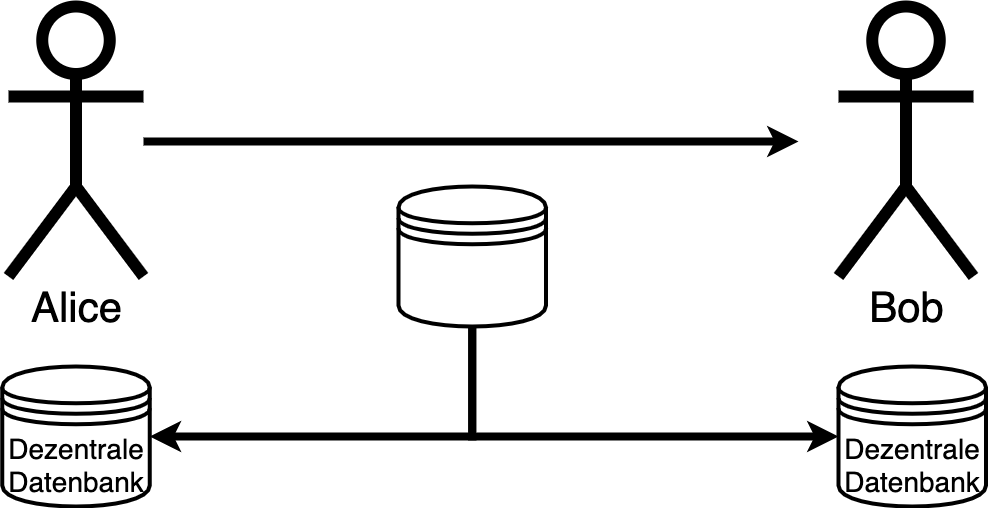

---
title: Einführung in die Programmierung
author: Peter Giger
reference-section-title: "References"
...

# Dokumente

[Slides](slides.html)

[PDF](files/test.pdf)

# Lernziele

>
- Sie können den Namen und ungefähren Wert von mind. 2 verschiedenen Kryptowährungen auswendig aufzählen.
- Sie können ein Beispiel einer Transaktion anhand eines vorgegebenen Falles aufzeichnen.
- Sie kennen das "Double Spending Problem" und können es anhand eines Beispiels in eigenen Worten beschreiben.
- Sie kennen die wichtigsten Eigenschaften einer kryptografischen Hashfunktion und verstehen, wieso diese in der Informatik nützlich ist.
- Sie verstehen, wie der Proof-of-Work funktioniert und für was er verwendet wird.
- Sie verstehen das Prinzip der Public-Key Kryptografie, warum die digitale Signatur für Kryptowährungen essenziell ist und können hypothetische Beispiele anhand eines vorgegebenen (mathematischen) Beispiels berechnen. 

# Was ist eine Kryptowährung?
Die Definition laut Wikipedia [@wikipedia2021kryptowährung]:

> Eine Kryptowährung ist ein **digitaler Vermögenswert**, der auch als Tauschmittel fungiert. Einzelne Vermögenszuschreibungen sind dabei in einer **dezentralen Datenbank** (Distributed-Ledger-Technologie), in der Regel einer **Blockchain**, festgehalten. Diese öffentliche Finanztransaktionsdatenbank verwendet starke **Kryptographie**, um die **Transaktionen** und Besitztümer und gegebenenfalls die Erschaffung von weiteren Coins oder auch die Vernichtung von Coins zu verifizieren und zu sichern.

Einfach gesagt: Eine Kryptowährung ist "**Digitales Geld**", das **ohne Intermediär** (z. B. Banken) auskommt. Die Sicherheit wird durch **kryptografische Methoden** (z. B. Verschlüsselung) sichergestellt. Die erste und wohl bekannteste Kryptowährung ist Bitcoin [@nakamoto2012bitcoin]. Diese wurde von Satoshi Nakamoto (Pseudonym) entwickelt und 2008 als White Paper veröffentlicht. 

**Aufgabe:** Zählen sie 3 verschiedene Kryptowährungen auf inkl. deren Wert in CHF (aktuell, vor einem Monat und vor einem Jahr). Was ist dabei auffällig (Stichwort: Volatilität)? Welche Faktoren beeinflussen den Wert von Kryptowährungen?
<!---
Lösung:
Bitcoin: 45000, 35000, 10000
Ethereum: 3000, 2000, 500
Dogecoin: 0.29, 0.19, 0.0002
-> Faktoren: Angebot/Nachfrage, Produktionskosten (Mining), Twitter, Vorschriften, News/Twitter...
--->

\TextField[name=T1, multiline=true, height=5\baselineskip, width=\hsize, bordercolor={0 0 0}]{}

\newpage
# Zentrale vs. dezentrale Datenbank

Traditionell sind Banken für den Schutz unseres Geldes zuständig. Wenn wir etwas online kaufen, prüfen sie, ob genug Geld vorhanden ist und führen dann die Transaktion durch. Als Beispiel: Alice hat von Bob ein iPhone gekauft und überweist 1000.- auf sein Konto. Eine Transaktion könnte wie folgt aussehen:

{ height=150px }

| Betrag | Von | An |
|---|---|---|
| 1000.- | Alice | Bob |

Table: Datenbank des Intermediärs

Diese Transaktion wird in einer zentralen Datenbank gesichert. Die Bank stellt als vertrauenswürdiger Intermediär sicher, dass alles "richtig" läuft. Bitcoin und andere Kryptowährungen sind hingegen dezentral, d.h. die Transaktion erfolgt direkt von Person zu Person (peer-to-peer) und wird von jeder einzelnen Person gesichert und überprüft [@nakamoto2012bitcoin]. Als Vergleich: Kryptowährungen sind das Bargeld der digitalen Welt. Angeknüpft am vorherigen Beispiel werden die Transaktionen verteilt (dezentral) gesichert:

{ height=150px }

| Betrag | Von | An |
|---|---|---|
| 1000.- | Alice | Bob |

Table: Datenbank von Alice

| Betrag | Von | An |
|---|---|---|
| 1000.- | Alice | Bob |

Table: Datenbank von Bob

**Aufgabe:** Erstellen sie eine Transaktionstabelle für folgendes Beispiel: Alice überweist Charlie 200.-, Bob überweist Alice 300.- und Charlie überweist Bob 100.-.
<!---
Lösung:
| Betrag | Von      | An        |
|--------|----------|-----------|
| 200.-  | Alice    | Charlie   |
| 300.-  | Bob      | Alice     |
| 100.-  | Charlie  | Bob       |
--->

\TextField[name=T2, multiline=true, height=6\baselineskip, width=\hsize, bordercolor={0 0 0}]{}