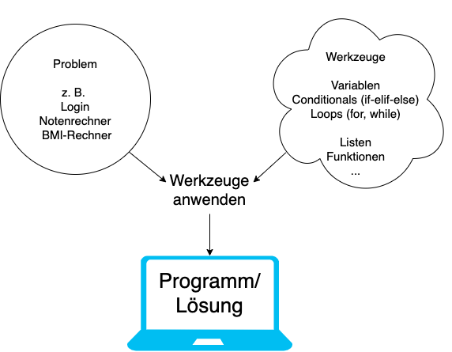
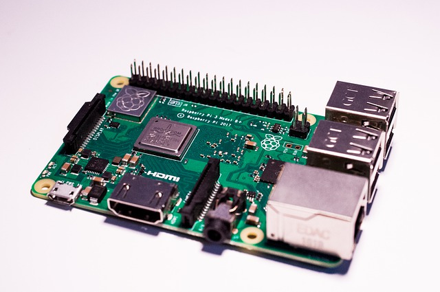

# Was ist Programmieren? <i class="fas fa-code"></i>

{ width=700px }


# Warum Python <i class="fas fa-question"></i>

1. Einfacher Syntax
   
   ```python
   def foo(x):
      if x == 0:
         bar()
      else:
         foo(x - 1)
   ```

2. Findet fast überall Verwendung
   
   - IoT: Raspberry Pi { width=100px }
   - Machine Learning: Netflix { width=75px }
   - Web App (Backend): Instagram { width=60px }
   - Web App (Frontend): -

# Ein Beispielprojekt von mir: <br> Gleitschirm Leinenreissmaschine <i class="fas fa-parachute-box"></i>

|||
| ----------------------------------- | ----------------------------------- | 
| { height=500px } | { height=500px } | 

# Ein Beispielprojekt von mir: <br> Gleitschirm Leinenreissmaschine <i class="fas fa-parachute-box"></i>

||||
| ----------------------------------- | ----------------------------------- | ----------------------------------- |
| { height=250px } | { height=250px } | { height=250px } |
| { height=250px } | { height=250px } | <video src="images/movie.mov" controls height="250px"></video> |

# Ausgabe: <br> Gleitschirm Leinenreissmaschine <i class="fas fa-parachute-box"></i>

```bash
------ Start Measurement ------
3 kg
10 kg
30 kg
70 kg
120 kg
160 kg
190 kg # Max. Zugfestigkeit
70 kg
20 kg
------ End Measurement ------
```

# Vereinfachter Code <i class="fas fa-parachute-box"></i>

```python
kgPrev = 0 # Vorherigen Wert initialisieren

while True:
    kg = driver.read() # Sensorwert auslesen (in kg)

    if (kg > 3.0) and (kgPrev < 3.0):
        # Zunehmender Leinenzug
        print("------ Start Measurement ------")
    elif (kg < 3.0) and (kgPrev > 3.0):
        # Abnehmender Leinenzug
        print("------ End Measurement --------") 
    elif (kg > 3.0):
        # Werte über 3 kg sollen ausgegeben werden
        print("kg: " + str(kg))
    
    kgPrev = kg # Vorherigen Wert aktualisieren
```

<!-- Archiv

# Lernziele <i class="fas fa-bullseye"></i>

> Sie verstehen den Unterschied zwischen Syntax und Semantik und können diesen anhand eines Beispiels in eigenen Worten beschreiben.

> Sie verstehen den Unterschied zwischen kompilierten und interpretierten Programmiersprachen und können jeweils einen Vor- und Nachteil aufzählen.

> Sie kennen den Unterschied zwischen Frontend und Backend und wissen, welche Geräte (Laptop, Server) jeweils gemeint sind.


# Auftrag: Bearbeiten Sie folgende Themen <br> (3 Gruppen, ca. 15 Minuten) <i class="fas fa-users"></i>

- Gruppe 1: [Syntax vs. Semantik](https://gadget-info.com/difference-between-syntax)
- Gruppe 2: [Kompilierte vs. interpretierte Sprache](https://www.elektronik-kompendium.de/sites/com/1705231.htm)
- Gruppe 3: [Backend vs. Frontend](https://www.ironhack.com/de/webentwicklung/front-end-vs-back-end-unterschied)

Eine (zufällige) Person pro Gruppe präsentiert ihr Thema

<small><br>Tipp: Bleiben sie produktiv! Machen sie z. B. eine kurze Zusammenfassung, welche sie dann mit ihren MitschülerInnen teilen. Schauen sie auch in die "Prüfungsvorbereitung" und überprüfen sie, ob sie das Thema verstanden haben (inkl. Notieren der Antworten).</small>

::: notes
- Syntax vs. Semantik:
  Die Syntax sind die Zeichen (z. B. 1 + 2) und die Semantik die Bedeutung (z. B. 1 + 2 = 3, aber theoretisch wäre auch 1 + 2 = 12 möglich). Die Semantik ist in Programmiersprachen einfach überprüfbar (z. B Klammern vergessen), die Syntax hingegen nicht.
- Kompilierte vs. interpretierte Sprache: 
  Ein Kompiler generiert eie Datei mit Maschinencode (Bits bzw. LLVM), ein Interpreter führt die Instruktionen direkt aus. Interpretierte Programme sind generell langsamer aber schneller in der Entwicklung (kein warten aufs kompilieren).
- Backend vs. Frontend:
  Das Frontend läuft auf einem Client (Handy, Laptop...), das Backend auf einem Server z. B. Google-Server inkl. Datenbanken etc.
:::
-->