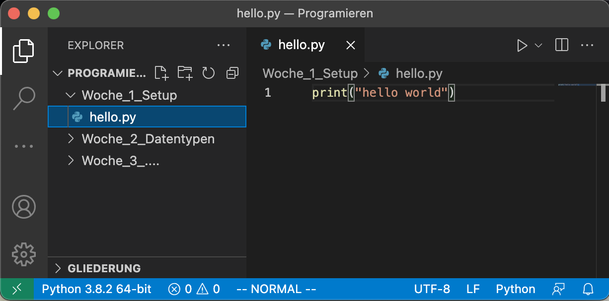

# Lernziele <i class="fas fa-bullseye"></i>

> Sie können ihre Programmierumgebung selbstständig installieren und einrichten.

> Sie organisieren ihre Dateien in einer geeigneten Verzeichnisstruktur, d. h. sie finden die jeweiligen Dateien in wenigen Sekunden


# Auftrag: Python/VSCode Installieren <i class="fas fa-download"></i>

1. Python 3 herunterladen und installieren (Mac-User müssen über [HomeBrew](https://brew.sh) installieren): 
   
   [https://www.python.org/downloads/](https://www.python.org/downloads/)

2. VSCode herunterladen und installieren:
   
   [https://code.visualstudio.com](https://code.visualstudio.com)

3. VSCode Python Extension installieren:
   
   [https://marketplace.visualstudio.com/items?itemName=ms-python.python](https://marketplace.visualstudio.com/items?itemName=ms-python.python)


# Auftrag: Installation überprüfen <i class="fas fa-check"></i>

1. Im VSCode: **Terminal -> Neues Terminal**

    ```bash
    # Folgenden Befehl ausführen:
    python3 --version

    # Der Output sollte Python 3.x sein:
    Python 3.9.7
    ```
2. Im VSCode: **Datei -> Neue Datei**
   
    ```python
    # Diesen Code einfügen und als "hello.py" speichern:
    print("Hello World")
    ```
    Dann auf **Ausführen -> Ohne Debuggen Ausführen**  
    (Ihr Terminal sollte nun "Hello World" anzeigen)

::: notes
- Demo
:::


# Auftrag: Adäquate Verzeichnisstruktur erstellen

1. Ordner für die Programmierung erstellen (z. B. Informatik -> Programmieren)
2. Im VSCode: **Datei -> Öffnen**
3. Geeigneten Verzeichnisstruktur erstellen, z. B.

    { width=100% }

::: notes
- Demo
:::