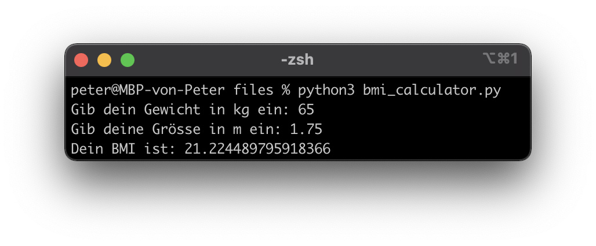

---
title: Variablen, Datentypen und Type Casting
author: Peter Giger
...

# Dokumente

[Slides](slides.html)


# Hilfreiche Links

**Wichtig:** Verbringen sie nicht zu viel Zeit mit der Theorie. Stundenlang Videos schauen oder Texte lesen, wird sie nicht weiterbringen. Beim Programmieren geht es um das "Können" und nicht um das "Wissen". Deshalb empfehle ich ihnen, selber zu experimentieren und viel zu üben (z. B. mit den Aufträgen oder eigenen Ideen/Projekten).

Auf **Youtube** finden sie (teilweise) gute Erklärvideos zum Thema Python. Hier sind einige Beispiellinks zu den Themen [Variablen](https://www.youtube.com/watch?v=jfOLXKPGXJ0), [Datentypen](https://www.youtube.com/watch?v=1WqFJ5wsA4o), [Input Funktion](https://www.youtube.com/watch?v=I9h1c-121Uk) und [Type Casting](https://www.youtube.com/watch?v=u_ECGvn1Z2c).

Die Plattform **W3Schools** bietet sich als Nachschlagewerk an (in Englisch). Hier sind die Links zu den Themen [Variablen](https://www.w3schools.com/python/python_variables.asp), [Datentypen](https://www.w3schools.com/python/python_datatypes.asp) und [Type Casting](https://www.w3schools.com/python/python_casting.asp).

Auf der Website von **Sylvia Lange** finden sie noch weitere (gute) Übungsaufgaben. Hier sind die [Aufgaben](https://sylvialange.de/python/Programmieraufgaben.pdf) (2, 3, 4, 6, 12) und die Lösungen
[[2]](https://sylvialange.de/python/python3/linear/NettoBrutto.py)
[[3]](https://sylvialange.de/python/python3/linear/Zins.py)
[[4]](https://sylvialange.de/python/python3/linear/Rabatt.py)
[[6]](https://sylvialange.de/python/python3/linear/Quader.py)
[[12]](https://sylvialange.de/python/python3/linear/Mittelwert.py)
zum Thema Variablen.

# Prüfungsvorbereitung

> Nennen sie die vier wichtigsten Datentypen und geben sie je ein Beispiel dazu.

> Was ist der Output von diesem Programm?
> ```python
> x = int(2.6)
> y = 2
> print(x * 2)
> ```

> Was ist der Output von diesem Programm?
> ```python
> x = "Hello "
> y = "World"
> print(x + y)
> ```

> Was ist der Output von diesem Programm?
> ```python
> a = 6
> b = 1.5
> c = a + b + (a / b)
> print("Output: " + str(c))
> ```

> Was macht dieses Programm?
> ```python
> x = float(input("Geben sie eine Zahl ein: "))
> print(x * x)
> ```

> Erstellen sie ein Programm, welches ihren BMI (Body-Mass-Index) berechnet. Der BMI ist denifiert als: $$ BMI = Gewicht (kg) / Grösse (m)2 $$ { width=100% }