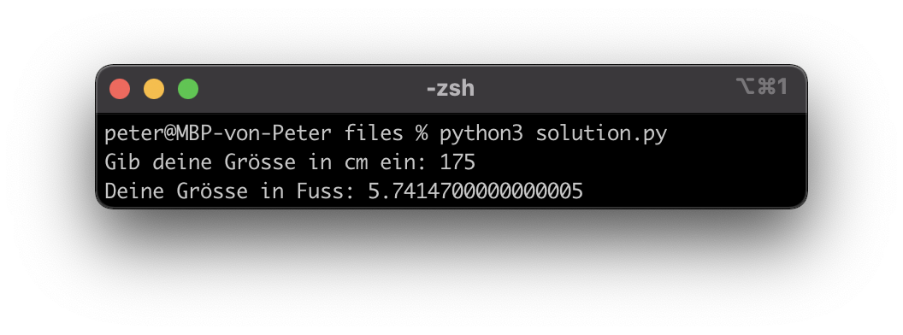

# Lernziele <i class="fas fa-bullseye"></i>

> Sie verstehen das Prinzip einer Variable und können dieses Wissen in einem Programm umsetzen

> Sie kennen die vier wichtigsten Datentypen und können diese (falls nötig) umwandeln

# Variablen <i class="fas fa-concierge-bell"></i>

Eine Variable ist ein Behälter, um Daten zu speichern (vgl. Mathematik).

```python
name = "Christian" # Variable erstellen und Wert zuweisen
print(name) # Output: Christian

name = 3 # Variable überschreiben
print(name) # Output: 3 

name = input("Gib deinen Namen ein: ") # Benutzereingabe (String)
print("Dein Name ist: " + name) # Output: ?
```

(Eine Variable sollte so benannt werden, dass jeder weiss, um was es geht z. B. nameOhneLetzerBuchstabe = "Christia")

::: notes
In der Mathematik ist eine Variable nur ein Konzept (Platzhalter, allgemeine Zahl), in der Informatik ein physischer Speicherplatz (Hardware).

Demo mit Box?
:::


# Datentypen <i class="fas fa-divide"></i>

Jede Variable hat einen Datentyp. Die vier wichtigsten:

```python
x = 5
print(type(x)) # Output: int (Integer/Ganzzahl)

x = 5.0
print(type(x)) # Output: float (Floating-Point/Kommazahl)

x = True
print(type(x)) # Output: bool (Boolean/Wahrheitswert)

x = "hello"
print(type(x)) # Output: string (String/Zeichenkette)
```

::: notes
:::


# Type Casting <i class="fas fa-divide"></i>

Manchmal muss man Datentypen umwandeln

```python
x = "Monat "
y = 12
print(x + y) # funktioniert nicht und macht keinen Sinn

x = "Monat "
y = 12
print(x + str(y)) # Output: Monat 12
```

Die Umwandlungsfunktionen sind analog zu den Datentypen:

```python
x = 5
int(x) # x ist bereits ein Integer
float(x) # 5.0
bool(x) # True
str(x) # "5"
```

::: notes
Demo am PC
:::


# Auftrag: Mein erstes Programm <i class="fas fa-shoe-prints"></i>

In Amerika ist die Längeneinheit "Fuss" (ft) auch heute noch in Gebrauch. 1 ft entspricht dabei 30.48 cm bzw. 1 cm entspricht 0.032808 ft.

|||
| ----------------------------------- | ----------------------------------- |
| { height=300px } | { height=300px } |
Erstellen Sie ein Programm, welches cm in ft umrechnet. Wie gross sind sie in Fuss?

::: notes
:::