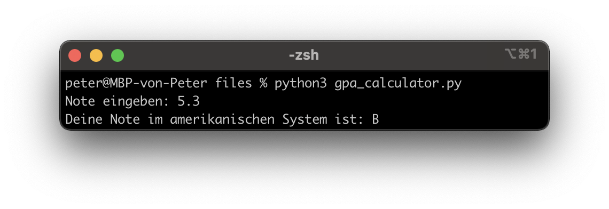

---
title: Conditionals (if-elif-else)
author: Peter Giger
...

# Dokumente

[Slides](slides.html)


# Hilfreiche Links

**Wichtig:** Verbringen sie nicht zu viel Zeit mit der Theorie. Stundenlang Videos schauen oder Texte lesen, wird sie nicht weiterbringen. Beim Programmieren geht es um das "Können" und nicht um das "Wissen". Deshalb empfehle ich ihnen, selber zu experimentieren und viel zu üben (z. B. mit den Aufträgen oder eigenen Ideen/Projekten).

Auf Wikipedia finden sie eine gute Zusammenfassung zum Thema [Flussdiagramm](https://de.wikipedia.org/wiki/Programmablaufplan). Auch hier gilt: "Versuchen sie es einfach". Erstellen sie doch einfach einmal ein Diagramm und fragen mich (oder MitschülerInnen), was ich davon halte. Wenn sie das Flussdiagramm digital erstellen wollen, empfehle ich Ihnen [draw.io](https://app.diagrams.net) (siehe "Flowchart").

Auf **Youtube** finden sie (teilweise) gute Erklärvideos zum Thema Python. Hier sind einige Beispiellinks zu den Themen [If-Anweisung](https://www.youtube.com/watch?v=b6KzYbM-Hvg) und [If-Elif-Else](https://www.youtube.com/watch?v=f3YdEdYSNdk).

Die Plattform **W3Schools** bietet sich als Nachschlagewerk an (in Englisch). Hier ist der Link zum Thema [Conditionals](https://www.w3schools.com/python/python_conditions.asp).


# Prüfungsvorbereitung

> Was ist der Output von diesem Programm? Erstellen sie ein Flussdiagramm dazu.
> ```python
> x = "Hello"
> y = "Tom"
> 
> if x != "Hello":
>   y = "Tim"
> 
> else:
>   y = "Tina"
> 
> print(y)
> ```

> Was ist der Output von diesem Programm? Erstellen Sie ein Flussdiagramm dazu.
> ```python
> x = 5
> 
> if x < 0:
>   print("a")
> 
> elif x > 0:
>   if x == 5:
>     print("b")
> 
>   print("c")
> 
> else:
>   print("d")
> ```

> Erstellen sie ein Programm, welches Schweizer Noten in das [amerikanische Notensystem](https://gpacalculator.net/grade-conversion/switzerland/) umrechnet.
>
> |Schweiz|US|
> |:-------|--:|
> |5.5-6   | A |
> |4.5-5.4 | B |
> |4.0-4.4 | C |
> |<4      | F |
> 
> { width=100% }