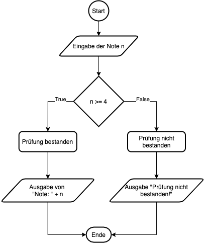
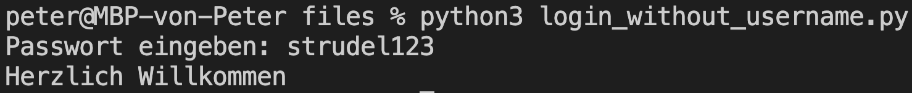
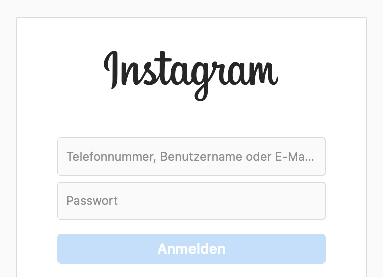
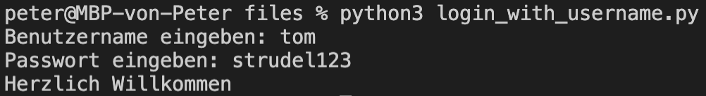

# Lernziele <i class="fas fa-bullseye"></i>

> Sie verstehen das Prinzip von Conditionals (If-Elif-Else) und können dieses Wissen in einem Programm umsetzen

> Sie können ein Flussdiagramm aufgrund von Programmcode (oder vice verca) erstellen

# Was sind Conditionals? <i class="fas fa-code-branch"></i><br> (Bedingte Anweisung & Verzweigung)

Conditionals kennen sie bereits aus ihrem Alltag z. B. 

> wenn Note > 4, dann Prüfung bestanden

In Python schreibt man "if Bedingung: dann". Die Bedingung ist dabei immer ein Boolean (True/False) z. B.

```python
if True:
  print("Dieser Output wird immer angezeigt")

if False:
  print("Dieser Output wird nie angezeigt")
```

::: notes
- Mehr Beispiele aus dem Alltag
:::


# Conditionals in Python (If-Elif-Else) <i class="fas fa-code-branch"></i>

```python
aString = input("Geben sie eine Ganzzahl ein: ")
a = int(aString) # Type Casting

if a > 1: # wenn a grösser als 1 ist
  print("a ist grösser als 1")

elif a < 1: # wenn a kleiner als 1 ist
  print("a ist kleiner als 1")

else: # wenn keine der vorherigen Bedingungen passt
  print("a ist gleich 1")
```

**Achtung:** Ein Vergleich in Python ist ==, eine Zuweisung ist =

```python
a = 5 # Ein Gleichheitszeichen ist eine Zuweisung
if a == 5: # Zwei Gleichheitszeichen sind ein Vergleich
  print("a ist gleich 5")

elif a != 5: # Ein Ausrufezeichen bedeutet "nicht-gleich"
  print("a ist nicht gleich 5")
```

::: notes
- Demo
:::


# Das Flussdiagramm als visuelle Darstellung <i class="fas fa-chart-pie"></i>

{ height=400px }

```python
n = int(input("Note eingeben: "))
if n >= 4:
  print("Note: " + str(n))
else:
  print("Prüfung nicht bestanden!")
```

::: notes
- Zeige Wikipedia / Drawio (flowchart)
:::


# Auftrag: Login mit Passwort <i class="fas fa-shoe-prints"></i>

(1) Programmieren Sie ein Login (nur mit Passwort, ohne Benutzernamen). Wenn das Passwort korrekt ist, soll "Herzlich Willkommen" erscheinen, andernfalls "Passwort nicht korrekt".

(2) Erstellen sie das Flussdiagramm dazu

|||
| ----------------------------------- | ----------------------------------- |
| { width=400px } | { height=100px } |

::: notes
:::


# Auftrag: Login mit Benutzer und Passwort <i class="fas fa-shoe-prints"></i>

(1) Ergänzen sie das Login mit einem Benutzernamen (neues .py file). Falls der Benutzer nicht existiert, soll "Benutzer nicht gefunden" ausgegeben werden.

(2) Erstellen sie ein Flussdiagrammm dazu

|||
| ----------------------------------- | ----------------------------------- |
| { width=400px } | { height=100px } |

::: notes
:::