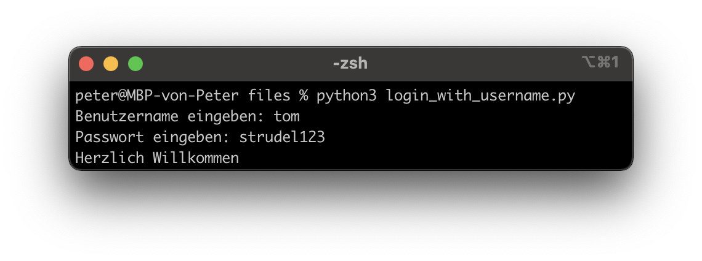

# Lernziele <i class="fas fa-bullseye"></i>

> Sie verstehen das Prinzip von Conditionals (If-Elif-Else) und können dieses Wissen in einem Programm umsetzen

> Sie können ein Flussdiagramm aufgrund von Programmcode (oder vice verca) erstellen

# Was sind Conditionals? <i class="fas fa-code-branch"></i><br> (Bedingte Anweisung & Verzweigung)

Conditionals kennen sie bereits aus ihrem Alltag z. B. 

> wenn Note $\geq$ 4, dann Prüfung bestanden

In Python schreibt man "if Bedingung: dann". Die Bedingung ist dabei entweder Wahr oder Falsch (Boolean) z. B.

```python
note = 4.5

if note >= 4: # wenn die note grösser gleich vier ist
  print("Prüfung bestanden") # dann ist die Prüfung bestanden
  print("...") # alles in einer If-Bedingung muss eingerückt sein

print("Mehr Code") # ohne Einrücken ist es wieder normaler Code
```

::: notes
- Mehr Beispiele aus dem Alltag
:::


# If-Elif-Else <i class="fas fa-code-branch"></i>

Mit **elif** (Abkürzung für "else-if") und **else** (deutsch: sonst) können sie mehrere Bedingungen verschachteln.

```python
if x > 1: # wenn x grösser als 1 ist
  print("x ist grösser als 1")

elif x < 1: # wenn x kleiner als 1 ist
  print("x ist kleiner als 1")

else: # wenn keine der vorherigen Bedingungen passt
  print("x ist gleich 1")
```

**Achtung:** Ein Vergleich in Python ist ==, eine Zuweisung ist =

```python
a = 5 # ein Gleichheitszeichen ist eine Zuweisung
if a == 5: # zwei Gleichheitszeichen sind ein Vergleich
  print("a ist gleich 5")

elif a != 5: # ein Ausrufezeichen bedeutet "nicht-gleich"
  print("a ist nicht gleich 5")
```

::: notes
- Demo
:::


# Logische Operatoren (Optional) <i class="fas fa-equals"></i>


**and** (Deutsch: und)

```python
x = 5
y = 6

if x == 5 and y == 6: # wenn x == 5 UND y == 6
	print("Beide Aussagen sind Wahr")
```

**or** (Deutsch: oder)

```python
if x == 5 or y == 6: # wenn x == 5 ODER y == 6
	print("Eine oder beide Aussagen sind Wahr")
```

**not** (Deutsch: nicht)

```python
if not x == 5: # gleich wie x != 5
	print("Die Aussage ist nicht Wahr")
```


# Was ihr vermeiden solltet <i class="fas fa-exclamation"></i>

**Vergleichen von Booleans mit ==**

```python
winter = True

if winter == True: # Schlechter Programmierstil
	print("Es ist Winter")

if winter: # Viel besser
	print("Es ist Winter")
```

**Vergleichen von Floats mit ==**

```python
meter = 1.8324

if meter == 1.8324: # Nicht gut, da Floats nur "ungefähr" sind
	print("Sie sind 1.83 Meter gross")

if meter > 1.83 and meter < 1.84: # Viel besser
	print("Sie sind 1.83 Meter gross")
```


# Das Flussdiagramm als visuelle Darstellung <i class="fas fa-chart-pie"></i>

{ height=400px }

```python
n = int(input("Note eingeben: "))
if n >= 4:
  print("Note: " + str(n))
else:
  print("Prüfung nicht bestanden!")
```

::: notes
- Zeige Wikipedia / Drawio (flowchart)
:::


# Auftrag: Login mit Passwort <i class="fas fa-shoe-prints"></i>

(1) Programmieren Sie ein Login (nur mit Passwort, ohne Benutzernamen). Wenn das Passwort korrekt ist, soll "Herzlich Willkommen" erscheinen, andernfalls "Passwort nicht korrekt".

(2) Erstellen sie das Flussdiagramm dazu

|||
| ----------------------------------- | ----------------------------------- |
| { width=300px } | { height=300px } |

::: notes
:::


# Auftrag: Login mit Benutzer und Passwort <i class="fas fa-shoe-prints"></i>

(1) Ergänzen sie das Login mit einem Benutzernamen (neues .py file). Falls der Benutzer nicht existiert, soll "Benutzer nicht gefunden" ausgegeben werden.

(2) Erstellen sie ein Flussdiagrammm dazu

|||
| ----------------------------------- | ----------------------------------- |
| { width=400px } | { height=300px } |

::: notes
:::