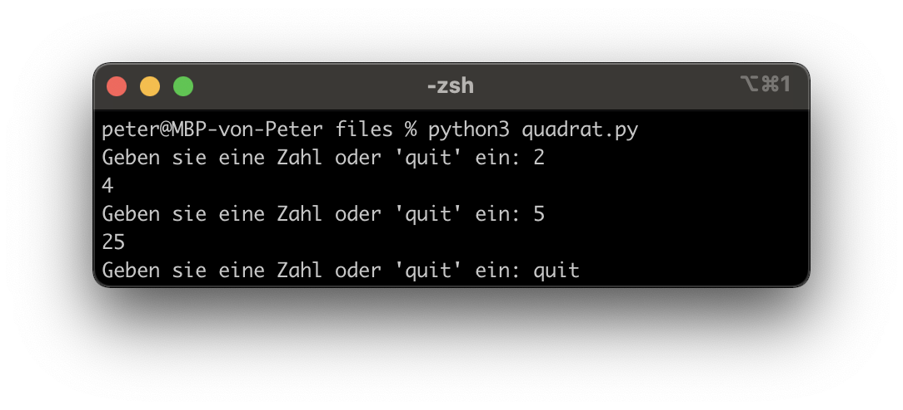
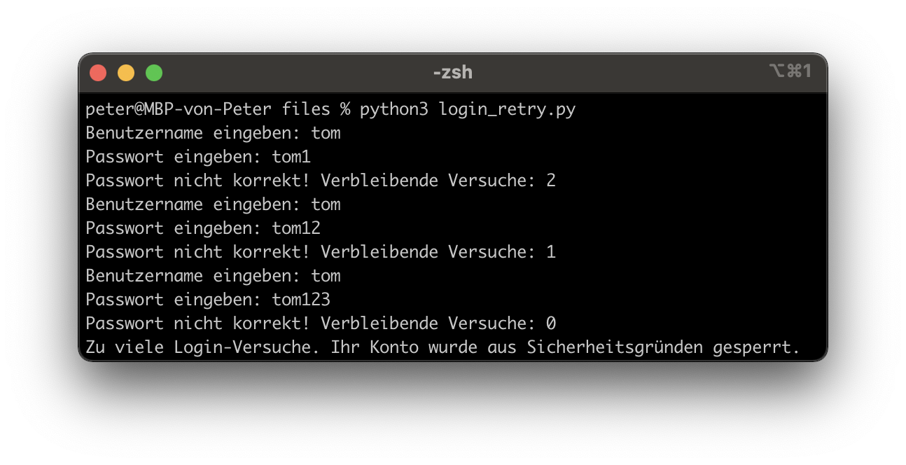

---
title: Loops (while, for) und Flussdiagramme
author: Peter Giger
...

# Dokumente

[Slides](slides.html)

[Gruppenarbeit Flussdiagramm](slides-gruppenarbeit-flussdiagramm.html)

# Lösungsvorschläge Aufträge

[Lösungsvorschlag Primarschule](files/primarschule.py)

[Lösungsvorschlag Fahrplan](files/fahrplan.py)

[Lösungsvorschlag Prüfungssoftware](files/prüfungssoftware.py)

[Lösungsvorschlag Prüfungssoftware Flussdiagramm](files/prüfungssoftware.drawio.png)


# Hilfreiche Links

**Wichtig:** Verbringen sie nicht zu viel Zeit mit der Theorie. Stundenlang Videos schauen oder Texte lesen, wird sie nicht weiterbringen. Beim Programmieren geht es um das "Können" und nicht um das "Wissen". Deshalb empfehle ich ihnen, selber zu experimentieren und viel zu üben (z. B. mit den Aufträgen oder eigenen Ideen/Projekten).

Auf Wikipedia finden sie eine gute Zusammenfassung zum Thema [Flussdiagramm](https://de.wikipedia.org/wiki/Programmablaufplan). Auch hier gilt: "Versuchen sie es einfach". Erstellen sie doch einfach einmal ein Diagramm und fragen mich (oder MitschülerInnen), was ich davon halte. Wenn sie das Flussdiagramm digital erstellen wollen, empfehle ich Ihnen [draw.io](https://app.diagrams.net) (siehe "Flowchart").

Auf **Youtube** finden sie (teilweise) gute Erklärvideos zum Thema Python. Hier sind einige Beispiellinks zu den Themen [While-Schleife](https://www.youtube.com/watch?v=sXLicTuJzB4&list=PL_pqkvxZ6ho3u8PJAsUU-rOAQ74D0TqZB&index=13) und [For-Schleife](https://www.youtube.com/watch?v=pQh5Idw2sKM&list=PL_pqkvxZ6ho3u8PJAsUU-rOAQ74D0TqZB&index=17).

Die Plattform **W3Schools** bietet sich als Nachschlagewerk an (in Englisch). Hier ist der Link zum Thema [While-Loop](https://www.w3schools.com/python/python_while_loops.asp) und [For-Loop](https://www.w3schools.com/python/python_for_loops.asp).

Auf der Website von **Sylvia Lange** finden sie noch weitere (gute) Übungsaufgaben. Hier sind die [Aufgaben](https://sylvialange.de/python/Programmieraufgaben.pdf) (17, 18, 19, 20) und die Lösungen
[[17]](https://sylvialange.de/python/python3/schleifen/Potenz.py)
[[18]](https://sylvialange.de/python/python3/schleifen/Fakultaet.py)
[[19]](https://sylvialange.de/python/python3/schleifen/Zweierpotenz.py)
[[20]](https://sylvialange.de/python/python3/schleifen/SterneRechteck.py)
zum Thema Loops/Schleifen.


# Prüfungsvorbereitung

> Lösungsvorschlag Aufträge
> 
> [Lösungsvorschlag Primarschule](files/primarschule.py)
> 
> [Lösungsvorschlag Fahrplan](files/fahrplan.py)
> 
> [Lösungsvorschlag Prüfungssoftware](files/prüfungssoftware.py)
> 
> [Lösungsvorschlag Prüfungssoftware Flussdiagramm](files/prüfungssoftware.drawio.png)

> Was ist der Output von diesem Programm? Übersetzen sie es in eine For-Schleife (wenn möglich) und erstellen sie ein Flussdiagramm dazu.
> ```python
> i = 2
> while i < 5:
>   print(i)
>   i = i + 1
>   print(i)
> ```
> 
> [Lösungsvorschlag Flussdiagramm](files/prüfungsvorbereitung_1.drawio.png)

> Was ist der Output von diesem Programm? Übersetzen sie es in eine For-Schleife (wenn möglich) und erstellen sie ein Flussdiagramm dazu.
> ```python
> i = 5
> while i < 10:
>   i += 1 # Kurzform von i = i + 1
>   if i == 8:
>     print("Katze")
>   else:
>     print(i)
> ```
> 
> [Lösungsvorschlag Code](files/prüfungsvorbereitung_2.py)
> 
> [Lösungsvorschlag Flussdiagramm](files/prüfungsvorbereitung_2.drawio.png)

> Erstellen sie ein Programm, welches eine Zahl quadriert. Dabei soll das Programm so lange ausgeführt werden, bis der Benutzer 'quit' eingibt.
> 
> { width=100% }
> 
> [Lösungsvorschlag](files/quadrat.py)


> Erweitern sie das Login aus dem Auftrag "Conditionals", sodass das Konto nach 3 Fehlversuchen gesperrt wird.
> 
> { width=100% }
> 
> [Lösungsvorschlag](files/login_retry.py)

> Erstellen sie ein Programm, welches als Input eine Zahl nimmt und daraus die Fibonacci-Folge berechnet. Erstellen sie zusätzlich ein Flussdiagramm dazu.
>
> Was ist die Fibonacci-Folge? [Hier Klicken (SimpleClub)](https://www.youtube.com/watch?v=fLuVeooxBqw)
> 
> { width=100% }
> 
> [Lösungsvorschlag Code](files/fibonacci.py)
> 
> [Lösungsvorschlag Flussdiagramm](files/fibonacci.drawio.png)