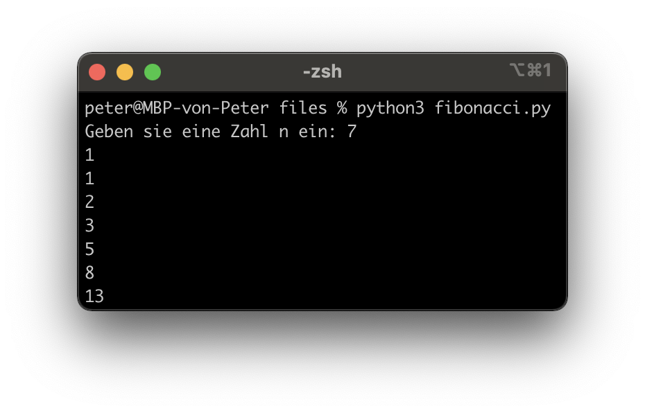

# Lernziele <i class="fas fa-bullseye"></i>

> Sie verstehen das Prinzip von Loops (while, for) und können dieses Wissen in einem Programm umsetzen

> Sie können ein Flussdiagramm aufgrund von Programmcode (oder vice verca) erstellen

# Was sind Loops? (Schleifen) <i class="fas fa-redo"></i>

Loops (Wiederholungen) kennen sie bereits aus ihrem Alltag, z. B. Video-Loops auf [Youtube](https://www.youtube.com/watch?v=kdBAdHR4n7A) (Rechtsklick > Wiederholen)

In Python gibt es zwei Arten von Loops:

```python
# (1) While-Loop

i = 0
while i < 5: # solange i < 5
  print("hallo", end=" ") # print ohne neue Zeile
  i = i + 1 # i um eins erhöhen

# Output: hallo hallo hallo hallo hallo
```

```python
# (2) For-Loop

for i in range(0, 5): # für jedes i von 0 bis 5
  print("hallo", end=" ") # print ohne neue Zeile

# Output: hallo hallo hallo hallo hallo
```

::: notes
:::


# While-Loops in Python <i class="fas fa-redo"></i>
Generell gilt: While-Loops können alles, was For-Loops können und noch mehr. Trotzdem sollte man in den meisten Fällen For-Loops verwenden.
```python
i = 5 # Zähler-Variable definieren
while i < 10:
  print(i, end=" ")
  i = i + 1 # Zähler-Variable erhöhen

# Output: 5 6 7 8 9
```

Die Bedingung ist, wie bei if-elif-else, ein Boolean:

```python
while True: # Unendliche Schleife
  print("hallo")

# Output: hallo hallo hallo hallo hallo hallo hallo hallo ...
```

::: notes
- Vgl. Misra-C + Leserlichkeit
- Demo
:::


# For-Loops in Python <i class="fas fa-redo"></i>

For-Loops sind "Syntactic Sugar" für While-Loops, wobei die Funktion "range(von, bis)" notwendig ist. Die Zähler-Variable (z. B. i) iteriert dabei durch den "range".

```python
for i in range(5, 10):
  print(i, end=" ")

# Output: 5 6 7 8 9
```

Mit dem "break"-Befehl kann der Loop verlassen werden (funktioniert auch bei While-Loops)

```python
for i in range(5, 10):
  if i == 8:
    break # Loop verlassen
  print(i, end=" ")

# Output: 5 6 7
```

::: notes
- Demo
:::

# Das Flussdiagramm als visuelle Darstellung <i class="fas fa-chart-pie"></i>

{ height=300px }

```python
i = 2
while i < 10:
  print(i)
  i = i + 2
print("fertig")

# Output: 2 4 6 8 fertig
```

<small>(Da For-Loops nur "Syntactic Sugar" für While-Loops sind, werden diese als While-Loop dargestellt.)</small>

::: notes
- Zeige Wikipedia
- Demo
:::


# Auftrag: Prüfungssoftware Programmieren <i class="fas fa-shoe-prints"></i>

(1) Programmieren sie eine Software, welche eine Frage stellt (z. B. Was ist die Hauptstadt der Schweiz?) und nach 10 falschen Antworten "Prüfung leider nicht bestanden" ausgibt. Wenn die Frage richtig beantwortet wird, soll "Gratulation!" ausgegeben werden. <br><br><small>Tipp: Mit "ctrl-c" brechen sie die Ausführung des Programms ab</small>

(2) Erstellen sie das Flussdiagramm dazu


|||
| ----------------------------------- | ----------------------------------- |
| { height=200px } | { height=70px } |

::: notes
:::


# Auftrag: Fibonacci-Folge Berechnen <i class="fas fa-shoe-prints"></i>

Was ist die Fibonacci-Folge? [Hier Klicken (SimpleClub)](https://www.youtube.com/watch?v=fLuVeooxBqw)

(1) Erstellen sie ein Programm, welches als Input eine Zahl $ n $ nimmt und daraus die Fibonacci-Folge berechnet.
    
      $ F_n = F_{n - 1} + F_{n - 2} $

(2) Erstellen sie ein Flussdiagrammm dazu

|||
| ----------------------------------- | ----------------------------------- |
| { width=300px } | { height=200px } |

::: notes
:::