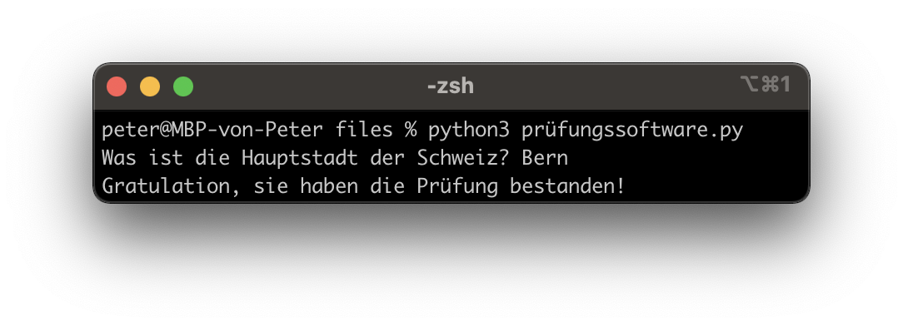

# Lernziele <i class="fas fa-bullseye"></i>

> Sie verstehen das Prinzip von Loops (while, for) und können dieses Wissen in einem Programm umsetzen

> Sie können ein Flussdiagramm aufgrund von Programmcode (oder vice verca) erstellen

# Was sind Loops? (Schleifen) <i class="fas fa-redo"></i>

Loops (Wiederholungen) kennen sie bereits aus ihrem Alltag, z. B. aus der [Musik](https://www.youtube.com/watch?v=C0jEJL-RdPo). In Python gibt es zwei Arten von Loops:

**While-Loop**
```python
i = 0 # Braucht eine Zähler-Variable
while i < 5: # Solange i < 5
  print(i)
  i = i + 1 # i um eins erhöhen

# Output: 0 1 2 3 4
```

**For-Loop**
```python
for i in range(0, 5): # Für jedes i von 0 bis 5
  print(i)

# Output: 0 1 2 3 4
```

::: notes
:::


# While-Loops vs. For-Loops <i class="fas fa-redo"></i>
While-Loops können alles, was For-Loops können und noch mehr. Trotzdem sollte man in den meisten Fällen For-Loops verwenden, da diese weniger fehleranfällig sind.

<br>
Warum sind For-Loops weniger fehleranfällig? Der Bereich (englisch: range) muss mit einer Funktion "range(von, bis)" vorgegeben werden.

```python
for i in range(5, 10): # range(von, bis)
  print(i)

# Output: 5 6 7 8 9
```

::: notes
- Vgl. Misra-C + Leserlichkeit
- Demo
:::


# Unendliche Loops & Loops verlassen <i class="fas fa-times"></i>

Mit "while True:" erzeugt man einen **unendlichen** Loop:

```python
while True: # Unendliche Schleife
  print("hallo")

# Output: hallo hallo hallo hallo hallo hallo hallo hallo ...
```

<small>(Tipp: Mit "ctrl-c" brechen sie ein Programm ab, fall sie in einem unendlichen Loop stecken bleiben.)</small>

Mit "break" kann man einen Loop wieder **verlassen**

```python
i = 0
while True:
  print(i)
  if i == 100:
	  break # Loop verlassen
  i = i + 1

# Output: 0 1 2 4 5 ... 98 99 100
```

::: notes
- Demo
:::

# Das Flussdiagramm als visuelle Darstellung <i class="fas fa-chart-pie"></i>

{ height=300px }

```python
i = 2
while i < 10:
  print(i)
  i = i + 2
print("fertig")

# Output: 2 4 6 8 fertig
```

<small>(Da For-Loops nur "Syntactic Sugar" für While-Loops sind, werden diese als While-Loop dargestellt.)</small>

::: notes
- Zeige Wikipedia
- Demo
:::

# Auftrag: Stellen sie sich vor, sie seien wieder in der Primarschule <i class="fas fa-school"></i>

{ height=130px }

1. Die Lehrerin möchte, dass sie die Zahlen von 1 bis 1000 aufschreiben. Automatisieren sie diesen Auftrag.

2. Die Lehrerin verlangt nun, dass sie von 1000 wieder rückwärts auf 1 zählen. Erstellen sie ein Programm.

3. Nun möchte die Lehrerin auch noch, dass sie die 7er-Reihe bis 1000 (1x7, 2x7, 3x7...) aufschreiben. Erstellen sie wieder ein Programm.

# Auftrag: Fahrplan Luzern - Engelberg <i class="fas fa-subway"></i>

Der IR (Interregio) von Luzern nach Engelberg fährt nur 1x pro Stunde. Der erste Zug fährt um 6:12 und der letzte Zug um 20:12. 

1. Erstellen sie ein Programm, welches den Fahrplan ausgibt (ohne jeden Zug einzeln aufzuschreiben)
2. Erstellen sie das Flussdiagramm dazu

|||
| ----------------------------------- | ----------------------------------- |
| { height=250px } | { height=300px } |


# Auftrag: Prüfungssoftware Programmieren <i class="fas fa-shoe-prints"></i>

(1) Programmieren sie eine Software, welche eine Frage stellt und nach 3 Fehlversuchen "Prüfung leider nicht bestanden" ausgibt (inkl. verbleibende Versuche). Wenn die Frage richtig beantwortet wird, soll "Gratulation!" ausgegeben werden.

(2) Erstellen sie das Flussdiagramm dazu


|||
| ----------------------------------- | ----------------------------------- |
| { height=300px } | { height=200px } |

::: notes
:::