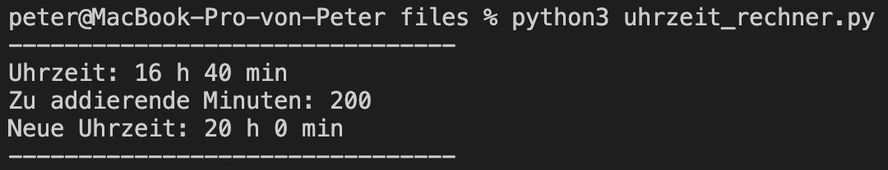

# Lernziele <i class="fas fa-bullseye"></i>

> Sie verstehen das Prinzip von Funktionen und können dieses Wissen in einem Programm umsetzen


# Was sind Funktionen? <i class="fas fa-calculator"></i>

Funktionen kennen sie bereits aus der Mathematik, <br> z. B. $$ f(x)=2x $$. 

In Python werden Funktionen mit "def"/"return" definiert und meistens verwendet, um Code besser zu strukturieren:

```python
# definition einer Funktion
def meine_funktion(x):
  return 2*x

# Funktionen können mehrmals aufgerufen werden
print(meine_funktion(2))
print(meine_funktion(4))

# Output: 4 8
```

(Im Gegensatz zu einer Variable sollte ein langer Funktionsname mit einem Bodenstrich getrennt werden z. B. "bmi_berechnen()" und nicht "bmiBerechnen()")

::: notes
- print / range haben sie bereits verwendet
- snake case
:::


# Parameter bzw. Argumente <i class="fas fa-concierge-bell"></i>

Funktionen können (müssen aber keine) Argumente haben:

```python
def funktion_ohne_argument():
  print("hello")

def funktion_mit_argument(x):
  print(x)

# Funktionen haben immer Klammern (mit oder ohne Argumente)
funktion_ohne_argument()
funktion_mit_argument("world")

# Output: hello world
```

Die Argumente sind nur innerhalb der Funktion erreichbar:

```python
def meine_funktion(x):
  print(x) # x ist das Argument/Parameter

print(x) # x wird nicht gefunden
```

::: note
:::


# Rückgabewert <i class="fas fa-exchange-alt"></i>

Funktionen können (müssen aber keinen) Rückgabewert haben. Ein Rückgabewert ist nichts anderes als eine Variable, welche ausserhalb der Funktion gespeichert werden kann:

```python
def funktion_ohne_rückgabewert(x):
  y = 2*x

def funktion_mit_rückgabewert(x):
  y = 2*x
  return y

v1 = funktion_ohne_rückgabewert(5)
v2 = funktion_mit_rückgabewert(5)

print(v1) # Output: None
print(v2) # Output: 10
```


# Reine vs. Modifizierte Funktionen <i class="fas fa-redo"></i>

In der Programmierung wird zwischen reinen ("pure") und modifizierten ("impure") Funktionen unterschieden. Reine Funktionen geben für den gleichen Input immer den gleichen Output z. B. mathematische Funktionen. Benutzen sie, wenn möglich, reine Funktionen!

```python
globaleVariable = 0 # das ist eine globale Variable

def reine_funktion(x):
  return 2*x

def modifizierte_funktion(x):
  global globaleVariable # auf globale Variable zugreifen
  globaleVariable = globaleVariable + 1
  return 2*x*globaleVariable

reine_funktion(4) # Output: 8
reine_funktion(4) # Output: 8
modifizierte_funktion(4) # Output: 8
modifizierte_funktion(4) # Output: 16 --> anderer Output
```

::: notes
:::


# Auftrag: Brief Adressieren <i class="fas fa-shoe-prints"></i>

(1) Erstellen sie eine Funktion, welche eine korrekt formatierte Adresse ausgibt. Rufen sie dann die Funktion auf und geben sie mind. 2 verschiedene Adressen aus. Die Funktion soll folgende Argumente besitzen:  
Vorname, Name, Strasse, Strassennr, Plz, Ort

|||
| ----------------------------------- | ----------------------------------- |
| { height=200px } | { height=200px } |

::: notes
:::


# Auftrag: Uhrzeit Addierer <i class="fas fa-shoe-prints"></i>

Erstellen sie eine Funktion, welche zu einer Uhrzeit beliebig viele Minuten dazuzählen kann. Als Beispiel:

```python
def uhrzeit_minuten_addieren(stunden, minuten, summand):
  # Ihr Code...

uhrzeit_minuten_addieren(17, 32, 8) # 17:32 + 8 Min = 17:40
uhrzeit_minuten_addieren(19, 7, 63) # 19:07 + 63 Min = 20:10
uhrzeit_minuten_addieren(16, 10, 1111) # 16:10 + 1111 Min = 10:41
```

|||
| ----------------------------------- | ----------------------------------- |
| { height=150px } | { height=150px } |

<small>(Tipp: Mit diesem [Tool](https://www.timeanddate.com/date/timeadd.html) können sie schauen, ob ihre Implementation das gleiche Resultat liefert)</small>

::: notes
:::