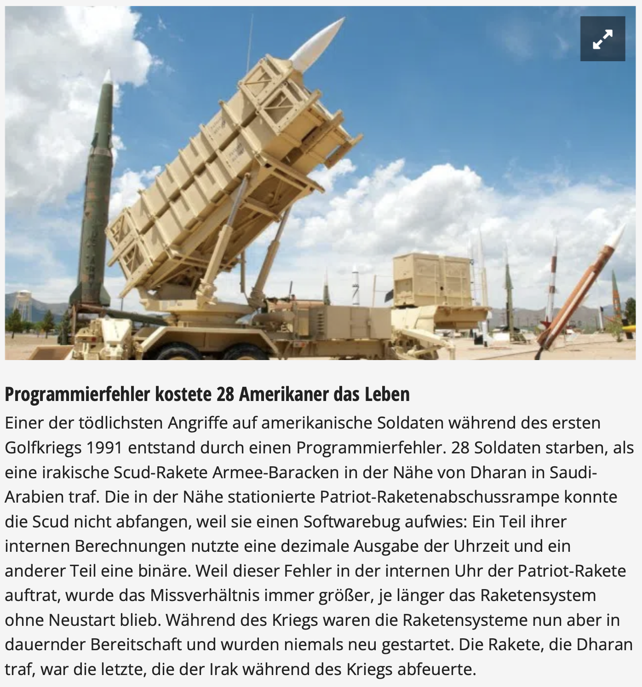

---
title: Listen
author: Peter Giger
...

# Dokumente

[Slides](slides.html)


# Hilfreiche Links

**Wichtig:** Verbringen sie nicht zu viel Zeit mit der Theorie. Stundenlang Videos schauen oder Texte lesen, wird sie nicht weiterbringen. Beim Programmieren geht es um das "Können" und nicht um das "Wissen". Deshalb empfehle ich ihnen, selber zu experimentieren und viel zu üben (z. B. mit den Aufträgen oder eigenen Ideen/Projekten).

Auf **Youtube** finden sie (teilweise) gute Erklärvideos zum Thema Python. Hier sind einige Beispiellinks zu den Themen [Listen I](https://www.youtube.com/watch?v=ihF8bZoauBs&list=PL_pqkvxZ6ho3u8PJAsUU-rOAQ74D0TqZB&index=14), [Listen II](https://www.youtube.com/watch?v=_XzWPXvya2w&list=PL_pqkvxZ6ho3u8PJAsUU-rOAQ74D0TqZB&index=15) und [Listen iterieren](https://www.youtube.com/watch?v=ISo1uqLcVw8&list=PL_pqkvxZ6ho3u8PJAsUU-rOAQ74D0TqZB&index=16).

Die Plattform **W3Schools** bietet sich als Nachschlagewerk an (in Englisch). Hier ist der Link zum Thema [Listen](https://www.w3schools.com/python/python_lists.asp).

Auf der Website von **Sylvia Lange** finden sie noch weitere (gute) Übungsaufgaben. Hier sind die [Aufgaben](https://sylvialange.de/python/Programmieraufgaben.pdf) (13) und die Lösungen
[[13]](https://sylvialange.de/python/python3/listen/WahlprogrammListen.py)
zum Thema Conditionals/Verzweigungen.


# Prüfungsvorbereitung

> Was macht diese Programm und was ist der Output?
> ```python
> x = [6, 3, 8, 5, 7, 2, 4, 0, 5]
> z = 0
> for y in x:
>     if y > z:
>         z = y
> print(z)
> ```

> Eine Liste kann auch "Unterlisten" haben. Schreiben sie ein Programm, welches die folgende Liste ausgibt:
> ```python
> x = [[1, 2],[3, 4],[5, 6]]
> ```
> { width=100% }

> Wievielmal kommt das Wort "die" (Gross- und Kleinschreibung) vor?
> Erstellen sie ein Programm, welches das Wort "die" (Gross- und Kleinschreibung) im folgenden Text zählt:
>
> ```python
> text = ["Einer", "der", "tödlichsten", "Angriffe", "auf", 
> "amerikanische", "Soldaten", "während", "des", "ersten", 
> "Golfkriegs", "1991", "entstand", "durch", "einen", 
> "Programmierfehler", ".", "28", "Soldaten", "starben", ",", 
> "als", "eine", "irakische", "Scud-Rakete", "Armee-Baracken", 
> "in", "der", "Nähe", "von", "Dharan", "in", "Saudi-Arabien", 
> "traf", ".", "Die", "in", "der", "Nähe", "stationierte",
> "Patriot-Raketenabschussrampe", "konnte", "die", "Scud", 
> "nicht", "abfangen", ",", "weil", "sie", "einen", 
> "Softwarebug", "aufwies", ":", "Ein", "Teil", "ihrer", 
> "internen", "Berechnungen", "nutzte", "eine", "dezimale",
> "Ausgabe", "der", "Uhrzeit", "und", "ein", "anderer", "Teil", 
> "eine", "binäre", ".", "Weil", "dieser", "Fehler", "in", 
> "der", "internen", "Uhr", "der", "Patriot-Rakete", "auftrat", 
> ",", "wurde", "das", "Missverhältnis", "immer", "größer", ",", 
> "je", "länger", "das", "Raketensystem", "ohne", "Neustart", 
> "blieb", ".", "Während", "des", "Kriegs", "waren", "die", 
> "Raketensysteme", "nun", "aber", "in", "dauernder", 
> "Bereitschaft", "und", "wurden", "niemals", "neu", "gestartet", 
> ".", "Die", "Rakete", ",", "die", "Dharan", "traf", ",", "war", 
> "die", "letzte", ",", "die", "der", "Irak", "während", "des", 
> "Kriegs", "abfeuerte", "."]
> ```
>
> { width=100% }
> [Quelle](https://www.computerwoche.de/a/13-wirklich-wahre-it-geschichten,3218843)