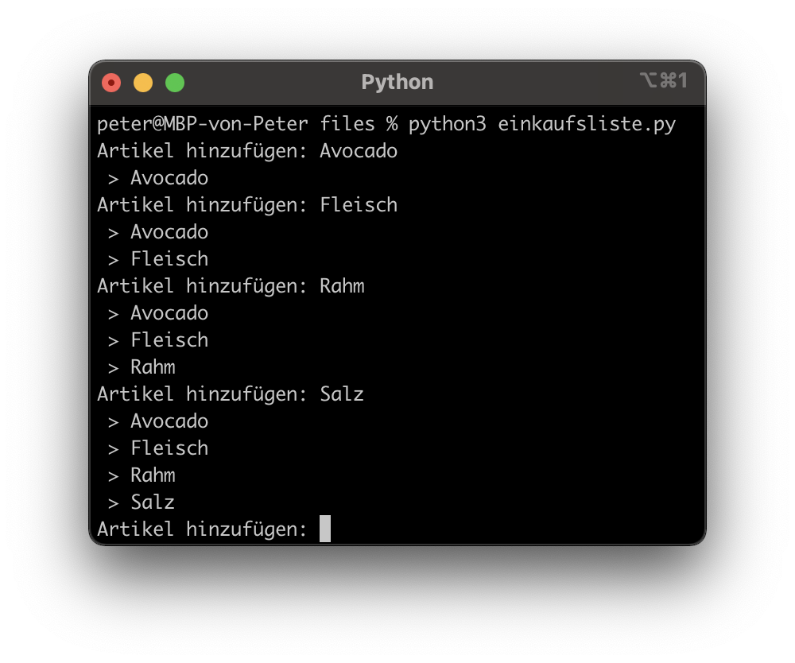
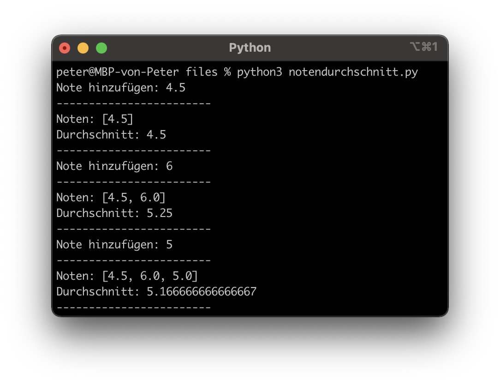

# Lernziele <i class="fas fa-bullseye"></i>

> Sie verstehen das Prinzip von Listen und können dieses Wissen in einem Programm umsetzen


# Was sind Listen? <i class="fas fa-list-ul"></i>

Eine Liste speichert mehrere Elemente, z. B. eine Einkaufsliste:

- Brot
- Nutella
- Milch
- ...

In Python werden Listen mit eckigen Klammern [] geschrieben:

```pythons
x = ["Brot", "Nutella", "Milch",] # Definition einer Liste

print(x) # Output: "['Brot', 'Nutella', 'Milch']"
```

::: notes
:::


# Zugriff auf Listenelemente <i class="fas fa-sync-alt"></i>

Der Zugriff auf Listenelemente erfolgt mit einem **Index**. [**0**] ist dabei das erste Element, [**1**] das zweite etc.

```python
einkaufsliste = ["Brot", "Nutella", "Milch",]

print(einkaufsliste[0]) # Output: Brot
print(einkaufsliste[1]) # Output: Nutella
print(einkaufsliste[2]) # Output: Milch
print(einkaufsliste[3]) # Output: IndexError: list index out of range
```

::: notes
Informatiker fangen bei 0 an zu zählen.
:::

Die Länge einer Liste erhält man mit der Funktion **len()**

```python
laenge = len(einkaufsliste) # Länge der Liste
print(laenge) # Output: 3
```

# Listen & Loops <i class="fas fa-redo"></i>

Listen sind iterierbar, d. h. folgendes funktioniert und sollte bevorzugt werden:

```python
for element in einkaufsliste:
  print(element)

# Output: Brot, Nutella, Milch
```

Wenn jedoch der Index benötigt wird, kann auch ein "normaler" Loop mit der len()-Funktion verwendet werden:

```python
for i in range(len(einkaufsliste)): # len() ist die Listenlänge
  print(einkaufsliste[i])
  print(i) # Vorteil: Man hat Zugriff auf den Index i

# Output: Brot 0, Nutella 1, Milch 2
```

::: note
:::


# Listenelemente bearbeiten <i class="far fa-edit"></i>

Ein Element ändern <i class="fas fa-pencil-alt"></i>:

```python
einkaufsliste = ["Brot", "Nutella", "Milch"]
einkaufsliste[1] = "Bananen" 
# Resultat: ['Brot', 'Bananen', 'Milch']
```

Ein Element hinzufügen <i class="fas fa-plus"></i>:

```python
einkaufsliste = ["Brot", "Nutella", "Milch"]
einkaufsliste.append("Bananen") 
# Resultat: ['Brot', 'Bananen', 'Milch', "Bananen"]
```

Ein Element löschen <i class="far fa-trash-alt"></i>:

```python
einkaufsliste = ["Brot", "Nutella", "Milch"]
einkaufsliste.pop()
# Resultat: ["Brot", "Nutella"]
```

::: note
:::


# Auftrag: Einkaufsliste <i class="fas fa-shoe-prints"></i>

Programmieren sie eine Einkaufsliste, bei der sie Artikel hinzufügen können. Die Liste soll dabei nach jeder Eingabe wieder ausgegeben werden.

|||
| ----------------------------------- | ----------------------------------- |
| { height=300px } | { height=350px } |

<small>Tipp: Mit "while: True" wird eine Schleife unendlich oft ausgeführt und mit CTRL-C können sie das Programm trotzdem terminieren</small>

::: notes
:::


# Auftrag: Notendurchschnittsrechner <i class="fas fa-shoe-prints"></i>

Programmieren sie einen Notendurchschnittsrechner. Das Ziel: Sie können ihre Noten eingeben und der Rechner gibt ihnen ihren aktuellen Durchschnitt zurück.

|||
| ----------------------------------- | ----------------------------------- |
| { height=250px } | { height=350px } |

::: notes
:::