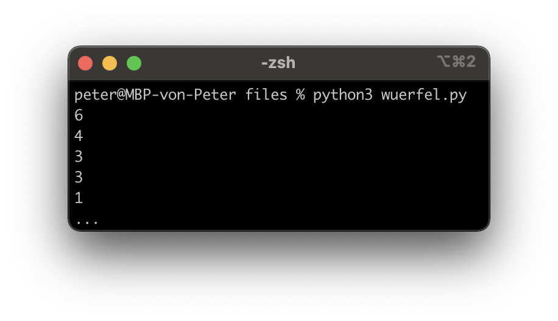

---
title: Funktionen
author: Peter Giger
...

# Dokumente

[Slides](slides.html)


# Hilfreiche Links

**Wichtig:** Verbringen sie nicht zu viel Zeit mit der Theorie. Stundenlang Videos schauen oder Texte lesen, wird sie nicht weiterbringen. Beim Programmieren geht es um das "Können" und nicht um das "Wissen". Deshalb empfehle ich ihnen, selber zu experimentieren und viel zu üben (z. B. mit den Aufträgen oder eigenen Ideen/Projekten).

Auf **Youtube** finden sie (teilweise) gute Erklärvideos zum Thema Python. Hier sind einige Beispiellinks zu den Themen [Funktionen I](https://www.youtube.com/watch?v=LQCfN5HS9xI&list=PL_pqkvxZ6ho3u8PJAsUU-rOAQ74D0TqZB&index=18), [Funktionen II](https://www.youtube.com/watch?v=af9ORp1Pty0&list=PL_pqkvxZ6ho3u8PJAsUU-rOAQ74D0TqZB&index=19) und [Funktionen III](https://www.youtube.com/watch?v=ehSP-sYoKCY&list=PL_pqkvxZ6ho3u8PJAsUU-rOAQ74D0TqZB&index=20).

Die Plattform **W3Schools** bietet sich als Nachschlagewerk an (in Englisch). Hier ist der Link zum Thema [Funktionen](https://www.w3schools.com/python/python_functions.asp).


# Prüfungsvorbereitung

> Lösungsvorschlag Aufträge
> 
> [Lösungsvorschlag Brief](files/brief_adresse.py)
>
> [Lösungsvorschlag Uhrzeit](files/uhrzeit_rechner.py)

> Was ist der Output von diesem Programm?
> ```python
> def meine_funktion(x, y, z):
>     if x > y:
>         return z
>     else:
>         return z - 1
> 
> x = meine_funktion(1, 2, 3)
> print(x)
> ```

> Was macht diese Funktion (in Worte gefasst)?
> ```python
> def meine_funktion(x, y):
>     if x > y:
>         return x
>     else:
>         return y
> ```

> Programmieren sie einen Würfel und würfeln sie 1000-mal. Um eine Zufallszahl zu generieren, können sie die Funktion "random()" verwenden. Diese generiert eine Zufallszahl zwischen 0 und 1 (float). Dafür müssen sie jedoch die Funktion zuerst importieren:
>
> ```python
> from random import random # Import der Funktion random()
> 
> def wuerfle():
>     zufallszahl = random() # Zufallszahl generieren
>     # Ihr Code kommt hier..
> ```
> (Tipp: Es gibt verschiedene Lösungswege z. B. mit if-then-else)
>
> { width=100% }
> 
> [Lösungsvorschlag](files/wuerfel.py)