# Lernziele <i class="fas fa-bullseye"></i>

> Sie kennen die Begriffe Git, GitHub, Open-Source Software, Markdown und können diese anhand eines Beispiels in Verbindung setzten

> Sie können ihren eigenen Code (inkl. Kommentare und Markdown-Dokumentation) auf GitHub veröffentlichen

# Experiment - Was macht dieser Algorithmus? <i class="fas fa-terminal"></i>

<br>
[Timer <i class="far fa-clock"></i>](https://timer.onlineclock.net) (1 Min.)
<br>
<br>

Klicken Sie auf den folgenden Link und versuchen Sie **alleine** herauszufinden, was der Algorithmus genau macht:
<br>
<br>

[https://allocate.monster/STOZYTST](https://allocate.monster/STOZYTST)


# Guter Code ist kommentierter Code <i class="far fa-comment-dots"></i>

Kommentare helfen, den Code zu verstehen. In Python starten Kommentare mit einem # und sollten in ganzen Sätzen (erstes Wort gross) geschrieben werden, z. B.

```python
# Gut

# Dieser Loop berechnet die 7er-Reihe bis 1000 (1x7, 2x7, 3x7…)
for i in range(int(1000 / 7)):
   print((i + 1) * 7)

# Schlecht
# (1) Ganze Sätze
# (2) Erste Wort muss gross sein
# (3) Kommentare sollen helfen, den Code zu verstehen.
#     z. B. "berechne (i+1)*7" steht bereits im Code,
#     dann braucht es keinen Kommentar dafür.

# loop bis 1000
for i in range(int(1000 / 7)):
   print((i + 1) * 7) # berechne (i+1)*7
```


<!--
# PEP 8 -- Style Guide für Python Code <i class="far fa-file-code"></i>

[PEP 8](https://www.python.org/dev/peps/pep-0008/) enthält Konvention, wie man "guten/schönen" Python-Code schreiben soll. Das hilft, damit andere Programmierer (und man selbst) den Code besser lesen können. Als Beispiel:

> "Function names should be lowercase, with words separated by underscores as necessary to improve readability.
> 
> Variable names follow the same convention as function names.
> 
> mixedCase is allowed only in contexts where that's already the prevailing style, to retain backwards compatibility."


# PEP 8 -- Das Wichtigste

|                 |                                                                                   |
| --------------- | --------------------------------------------------------------------------------- |
| Zeilenlänge:    | Max. 79 Zeichen                                                                   |
| Variablennamen: | Kleingeschrieben mit Unterstrich oder camelCase z. B. kebab_stand oder kebabStand |
| Leerzeichen:    | Ein Leerzeichen zwischen Operatoren z. B. x = 5 und nicht x=5                     |
| Kommentare:     | Ganze Sätze und das erste Wort grossgeschrieben z. B. # Das ist ein Kommentar     |


# PEP 8: Beispiel Zeilenlänge

```python
# Gut
x = float(input("Geben Sie eine Zahl ein: "))

# Schlecht - Mehr als 79 Zeichen (83 Zeichen mit Leerzeichen)
x = float(input("Geben Sie hier eine Zahl ein, welche über 10 und unter 20 ist: "))
```

# PEP 8: Beispiel Variablennamen

```python
# Gut
anzahl_der_schueler = 17

# Auch gut, aber die veraltete Schreibweise
anzahlDerSchueler = 17

# Schlecht - Nicht kleingeschrieben
Anzahl_der_Schueler = 17

# Schlecht - Der Variablenname soll selbsterklärend sein
x = 17

# Ausnahme: Loops und andere temporäre Variablen
for i in range(10):
   print(i)
```

# PEP 8: Beispiel Leerzeichen

```python
# Gut
i = 0
while i < 10:
   i = i + 1

# Schlecht - Kein Leerzeichen zwischen den Operatoren
i=0
while i<10:
   i=i+1
```

# PEP 8: Kommentare

```python
# Gut

# Dieser Loop berechnet die 7er-Reihe bis 1000 (1x7, 2x7, 3x7…)
for i in range(int(1000 / 7)):
   print((i + 1) * 7)

# Schlecht
# (1) Ganze Sätze
# (2) Erste Wort muss gross sein
# (3) Kommentare sollen helfen, den Code zu verstehen.
#     z. B. "berechne (i+1)*7" steht bereits im Code,
#     dann braucht es keinen Kommentar dafür.

# loop bis 1000
for i in range(int(1000 / 7)):
   print((i + 1) * 7) # berechne (i+1)*7
```
-->

# Was ist Open-Source Software? <br> Was ist Markdown? <i class="fas fa-lock-open"></i>

Umfrage: [hier klicken](https://www.menti.com/j8io3tpphy)

::: notes
- "Open Source" bedeutet, dass der Quellcode einer Software offen und frei zugänglich ist.
- Open Source-Anwendungen sind oft kostenlos. Allerdings handelt es sich nicht um einen geschützten Begriff und es gibt keine Garantie, dass Sie solche Programme gratis erhalten.
:::


# Was ist Git? <i class="fas fa-code-branch"></i>
- Kollaborations- und Versionsverwaltungstool für Softwareentwickler (vgl. Google Docs)
- 2005 von Linux-Gründer Linus Torvalds entwickelt
- Konsolenanwendung, aber es gibt auch GUIs
- De-Facto Standard in der Softwareindustrie

|                                         |                                         |
| --------------------------------------- | --------------------------------------- |
| 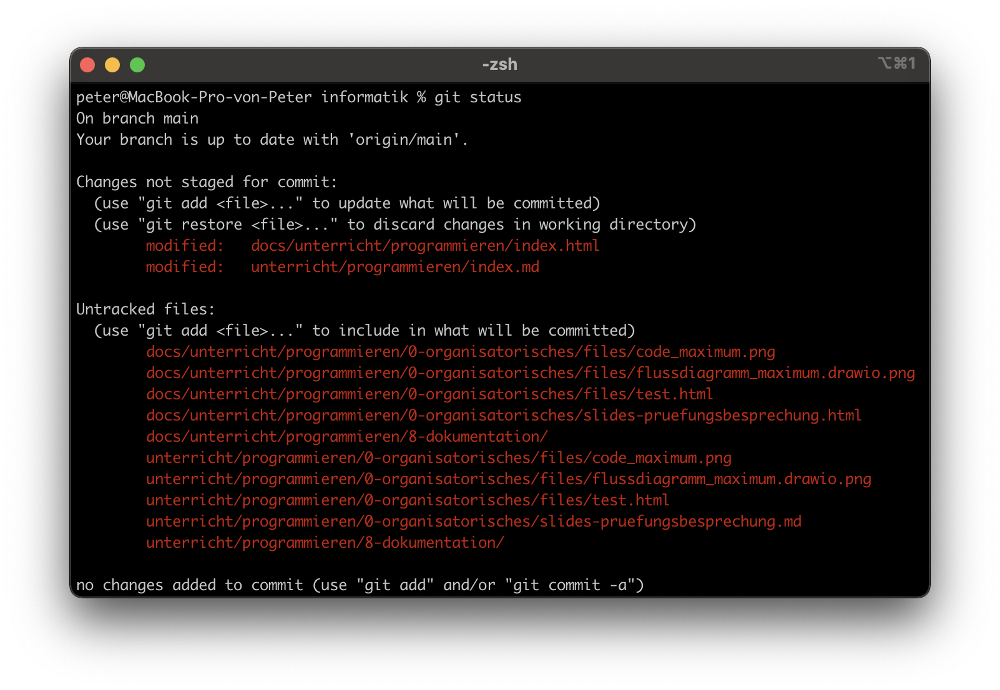{ height=300px } | 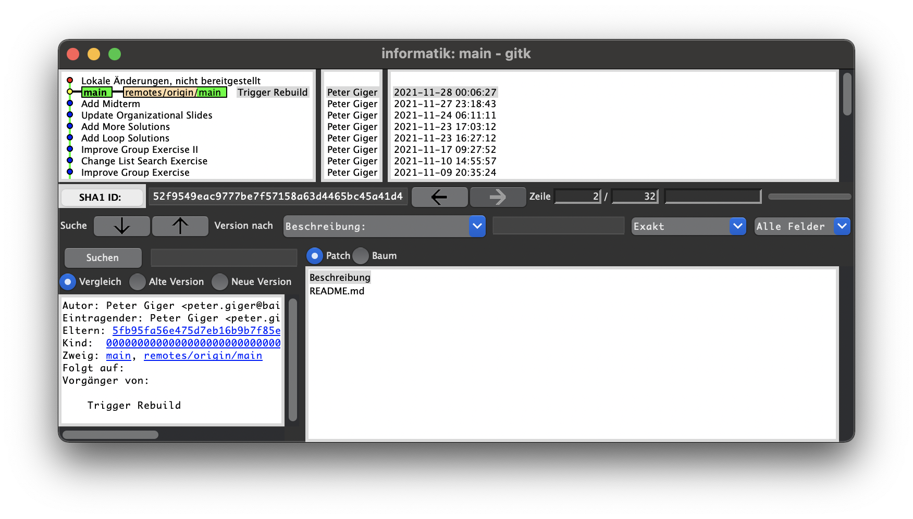{ height=350px } |

::: notes
- Früher: E-Mails
- Demo: Code Dokumentieren in Google Docs (mit 20 Personen)
- Git vs. Google Docs: Der Code wird bei Google Docs "live" bearbeitet, also kann es passieren, dass er plötzlich nicht mehr funktioniert. Für grössere Projekte wie z. B. der Linux-Kernel (27 Mio Zeilen Code, 21'000 Authoren) nicht mehr praktikabel.
:::


# Was ist GitHub? <i class="fab fa-github"></i>
- Hosting Service für Git <br> (also eine Website, welche einen Git-Server zur Verfügung stellt)
- De-Facto Standard für Open-Source Software (Linux, LibreOffice...)

{ height=350px }

::: notes
:::


# Live-Auftrag: GitHub Account Erstellen <i class="fas fa-shoe-prints"></i>

Erstellen Sie einen Account auf [GitHub](https://github.com) (Sign up). Die E-Mail-Adresse muss dabei echt sein, da Ihnen ein Verifizierungscode zugesendet wird.

|                                                 |                                                 |
| ----------------------------------------------- | ----------------------------------------------- |
| { height=350px } | 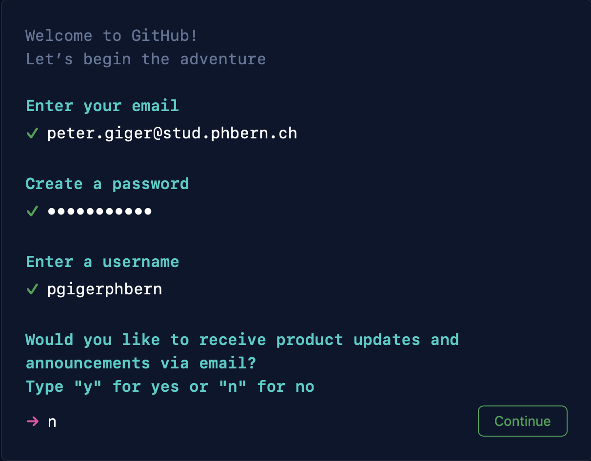{ height=350px } |


# Was ist ein Git(Hub) Repository? <i class="fab fa-github"></i>
- Ein Repository (Repo) ist ähnlich wie ein Ordner
- Generell gilt: 1 Projekt = 1 Repositorys
- Ein Repo kann öffentlich oder privat sein

<small>Beispiel Linux:</small>

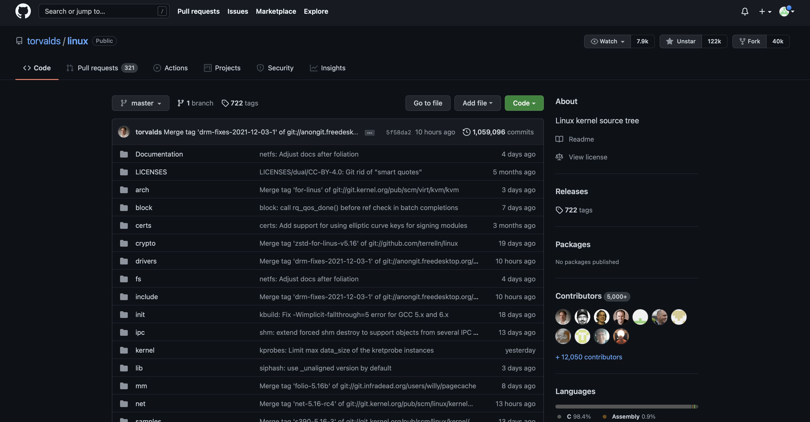{ height=350px }


# Live-Auftrag: GitHub Repo Erstellen <i class="fas fa-shoe-prints"></i>

Erstellen Sie nun ein GitHub Repositoy (create repository). Geben Sie dafür einen passenden Namen ein und vergessen Sie nicht, "Add a README file" zu wählen.

|                                               |                                               |
| --------------------------------------------- | --------------------------------------------- |
| 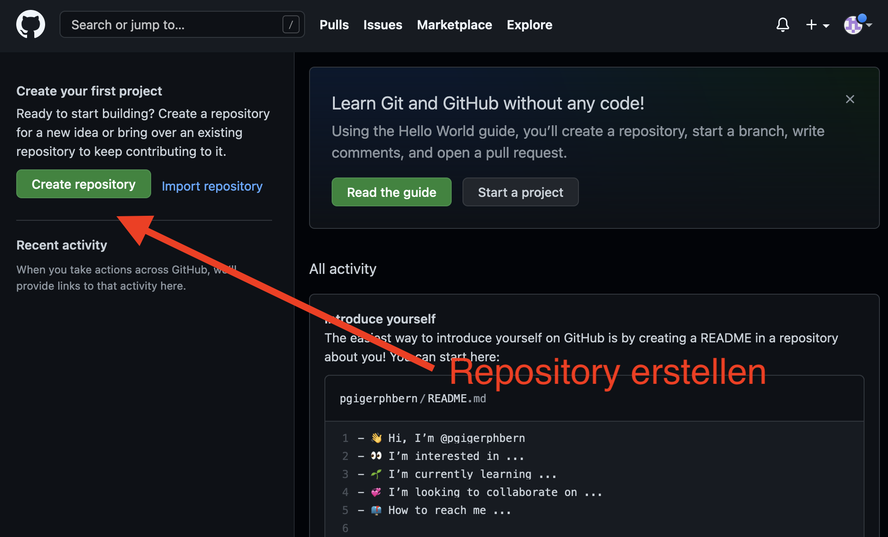{ height=350px } | 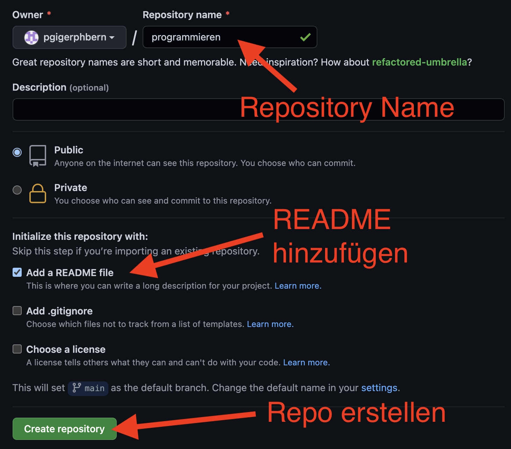{ height=350px } |


# GitHub, Markdown und das README.md <i class="fab fa-github"></i>

- Dokumentationen auf GitHub werden in Markdown geschrieben
- Das README.md beinhaltet die Dokumentation für das gesamte Repo. Beispiele: [Markdownify](https://github.com/amitmerchant1990/electron-markdownify#readme), [GitPoint](https://github.com/gitpoint/git-point#readme)
- Markdown Syntax vergessen? Siehe [Cheatsheet](https://github.com/adam-p/markdown-here/wiki/Markdown-Cheatsheet)

<small>Beispiel LibreOffice:</small>

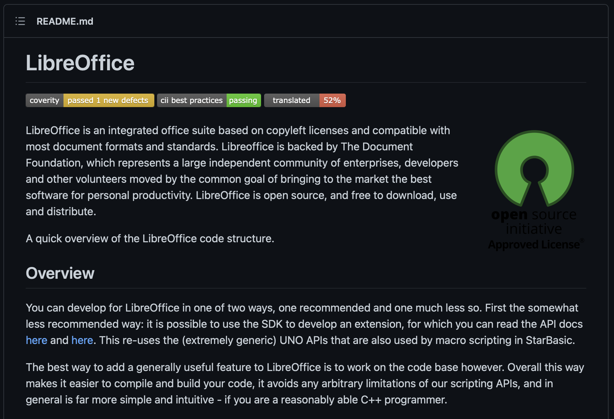{ height=250px }

::: notes
- GitHub Flavored Markdown
- Frage: Markdown Syntax z. B. Titel, Liste etc.
:::


# Live-Auftrag: GitHub README Bearbeiten <i class="fas fa-shoe-prints"></i>

Bearbeiten Sie nun das README.md (Markdown) und überprüfen Sie in der Vorschau, ob das Resultat Ihren Vorstellungen entspricht. Um die Datei zu speichern, geben Sie eine Beschreibung der Änderung ein und klicken Sie auf "Commit changes".

|                                                 |                                                 |
| ----------------------------------------------- | ----------------------------------------------- |
| 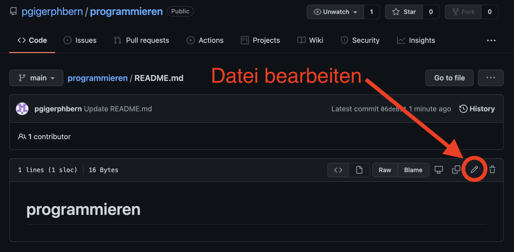{ height=300px } | 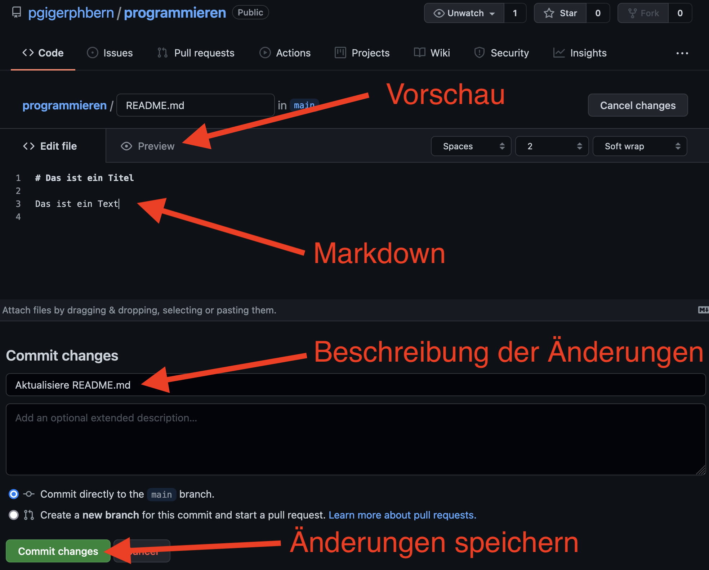{ height=300px } |


# Commits und Versionierung <i class="fas fa-history"></i>

- Commits beinhalten die Änderung einer/mehrerer Datein (History der Änderungen)
- Ein Commit sollte so benannt werden, dass klar ist, was geändert wurde
- Commits sollten in der Befehlsform geschrieben werden 

|                                                 |                                                 |
| ----------------------------------------------- | ----------------------------------------------- |
| 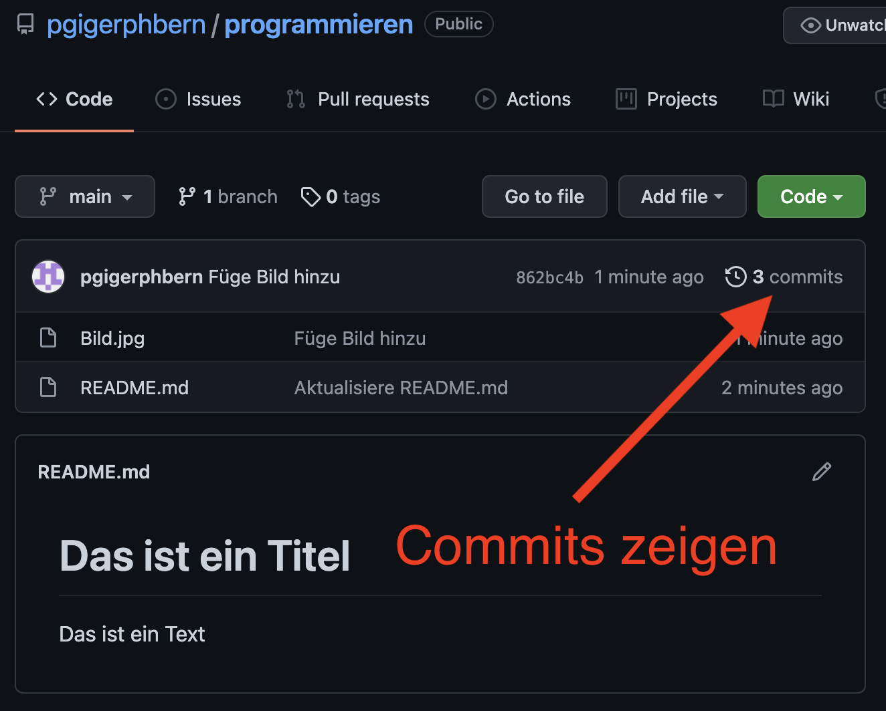{ height=200px } | 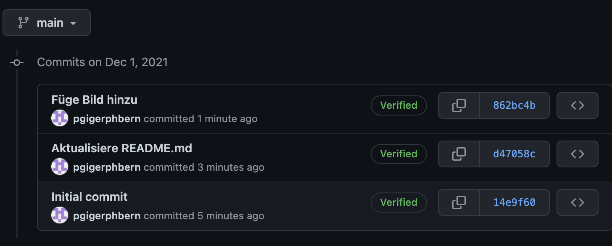{ height=200px } |


# Live-Auftrag: GitHub Datei Hochladen <i class="fas fa-shoe-prints"></i>

Laden Sie eine beliebige Datei (z. B. ein Bild oder .py Datei) auf GitHub. Benennen Sie den Commit korrekt und verständlich. Schauen Sie dann, ob ihr Commit erfolgreich hinzugefügt wurde.

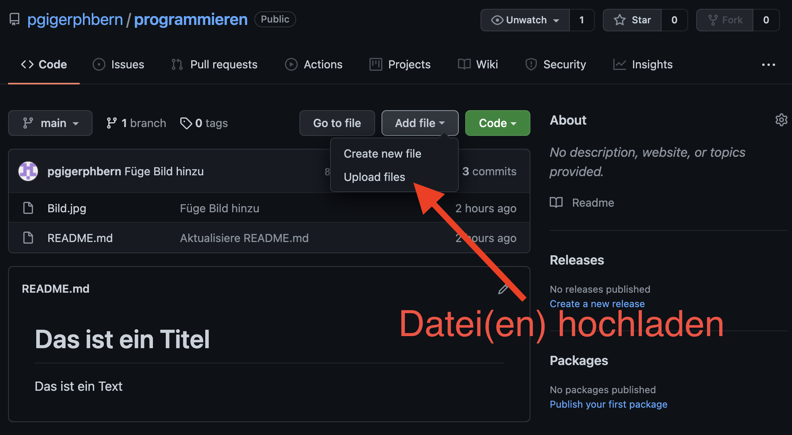{ height=400px }


# Auftrag (ca. 45 Min): Veröffentlichen Sie eines Ihrer Programme (z. B. aus den Aufträgen) auf GitHub <i class="fas fa-shoe-prints"></i>

1. Wählen Sie eines ihrer Programme
2. **Kommentieren** Sie ihren Code
3. Laden Sie den kommentierten Code (.py) auf GitHub
4. Dokumentieren Sie ihr Programm im **README.md**
   * **Einleitung**: Was macht es und wie wird es benutzt? <br> (mind. **3 Sätze** + mind. **1 Screenshot**)
   * **Features**: Eine Liste von Features (mind. **3 Punkte**)
   * **Reflexion**: Was haben Sie in den letzten Wochen gelernt und was nehmen Sie mit? (mind. **3 Sätze**)
5. Fügen Sie den **Link** zu ihrem Projekt [hier](https://docs.google.com/document/d/1x2KYgI5udH75z_oOjqKSRUAK_WgMr2-RoY5vt6Acj5I/edit?usp=sharing) ein.